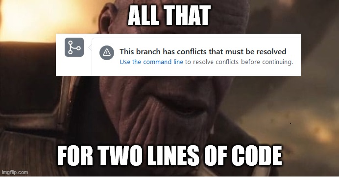
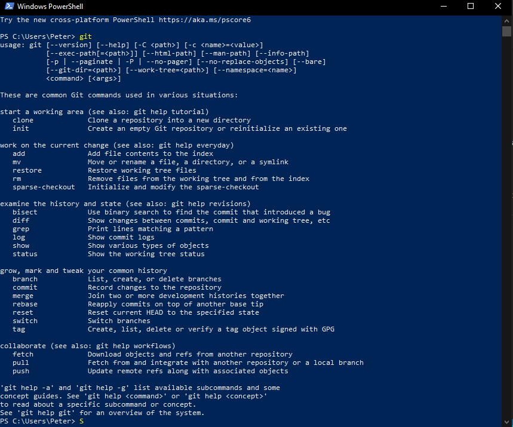
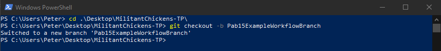
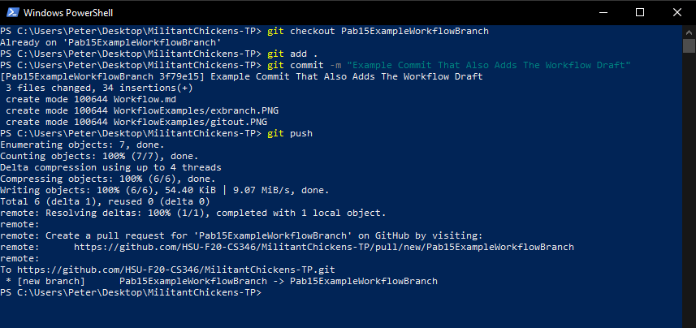
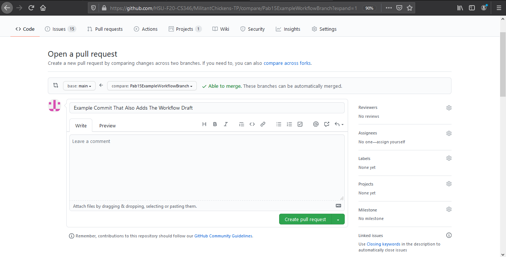
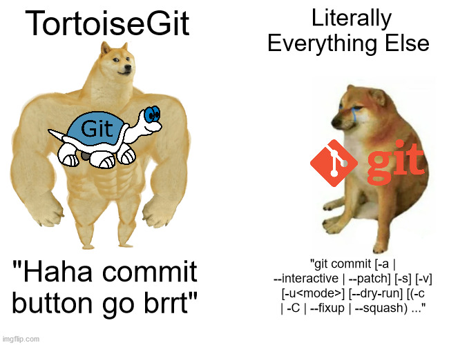
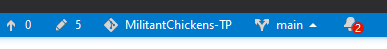
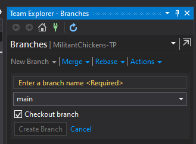

# Guide To Github Workflow - Pab15 

In this guide, I will lay out how I personally use git/github to:
- Create branches
- Commit to branches
- Push from branches
- Create a pull request

##### Follow this guide to avoid:

---

## Powershell:
Note: This section only applies to windows, for MacOS and Linux, Git should be installed automatically.
- If you haven't already, [download git](https://git-scm.com/download/win) 
- Follow the install directions
- Once completed, verify that Git is installed by opening powershell and running `git` in the shell. The output should match the output provided below:

---

## Creating a branch:
- In Powershell or Terminal, navigate to the cloned repository file
- To create the branch, run `git checkout -b <username+briefdescription>`. An example is provided below:

- Congrats! You created a new branch, and are now working under that branch.

## Commiting and pushing changes:
Note: DO NOT commit any changes unless you are working in a new branch
- First, make sure that you have staged your changes by running the command `git add .`
Note: You will not see any output from this command, do not be alarmed.
- Next, commit your changes by running `git commit -m "<commit message>"` 
Note: Be as descriptive as possible with your commit messages, but short enough that it will be within the commit message size.
- Finally, push your changes by running `git push`

## Creating a pull request:
- Once you have pushed your changes, navigate to the github site where the main folder of the project is located. You should see something like this:

- Next, click on "Compare & pull request". You should see a page like below:

- If you do not see the message "Able to merge. These branches can be automatically merged.", STOP. Do not attempt to merge.  
- If you do see the message, add a more descriptive comment and click on "Create pull request". You are now done, and whoever manages the pull requests can now review your request and merge. DO NOT merge your PR without review from the manager. This can mess a lot of things up.

## To pull from the main branch:
 - Navigate to the repository folder in Powershell
 - run `git branch --set-upstream-to=origin/main`
 - run `git pull`
 This should pull all recent changes from the main branch.

# Guide To - TortoiseGit - Github Workflow - jr408

## NOTICE: This guide covers creating and committing/pushing branches in TortoiseGit. Not pulling from main branch to update your local repository.
## I suggest that you read Pab15's guide first, since ordinary Git and Powershell are more versatile for pulling from the main branch
## WARNING: this guide assumes that you:
-are running on Windows 64-bit Operating System
-have git installed
-and use Visual Studio

---

##### Have you or a loved one been unable to merge automatically?
##### You are entitled to use TortoiseGit:

---

## TortoiseGit

Note: I am only aware of TortoiseGit working on Windows Machines, install on MacOS or Linux at your own risk
-For the uninitiated, [download TortoiseGit](https://tortoisegit.org/download/)
-Follow install directions
-Once installed, you can type TortoiseGit in your Windows Search Bar to confirm the installation

##WARNING: TortoiseGit operates automatically like a plug-in, you do not need to "start" TortoiseGit like an application

---

## Creating A Branch
- In Visual Studio, navigate to the bottom-right corner of the screen (pictured below)

-Click the up arrow that is next to "main" in the example
-A pop-up menu should appear, select "New Branch"
-A menu called "Team Explorer - Branches" will open (pictured below)

-Where it says "Enter a branch name <Required>, type in a name in-context to your work (i.e. "jr408-tortoisegit")
-Then click the no longer grayed-out "Create Branch"

---

## Comitting and Pushing Changes
## WARNING: Do not follow this step unless you have created and are in your new branch, never commit directly to main.
- Go to where your repository folder is located, and right-click

- You will see a section of three options, select the option that reads "Git Commit -> "yourname-newbranch ..."
### IF: you see "main" go back to Visual Studio and select a different branch
 
- After clicking on the "Git Commit -> ..." button, a window will pop-up

- Type in your ATOMIC message that describes the work you did
- TortoiseGit will automatically check if you made changes to code under the "Modified Files" path
- New files will be placed under the "Not Versioned" path and normally require you to "check" them in manually
- Finally, once you have checked your files and added your message click the Commit button with the down arrow in the bottom-right of the window
 

